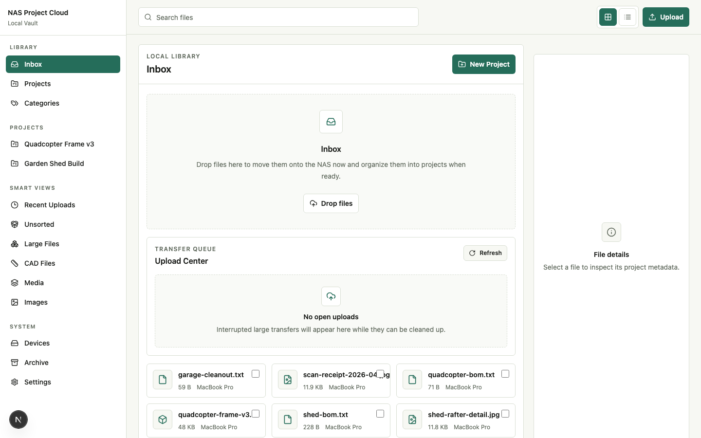
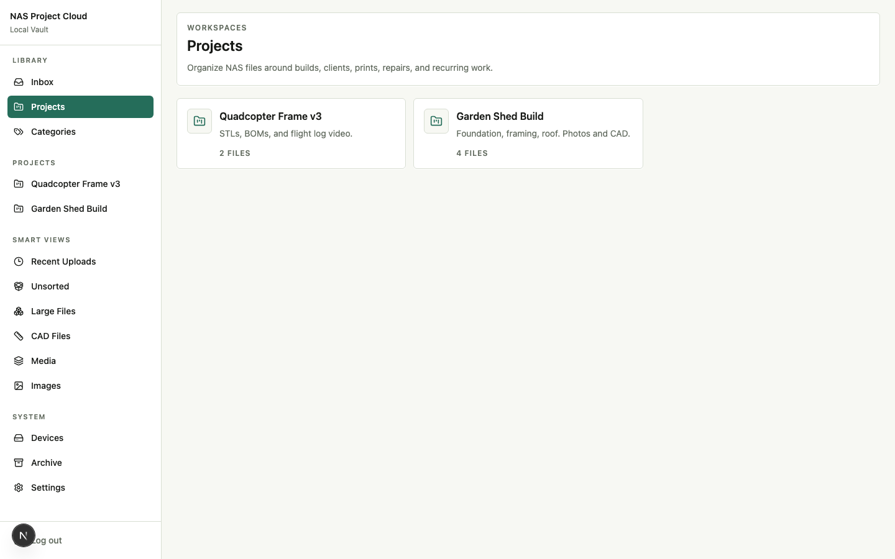
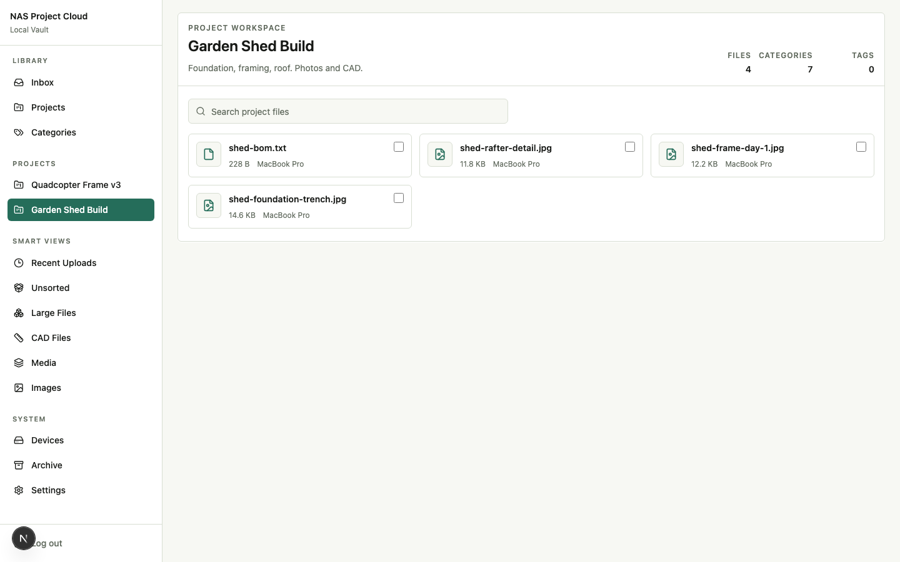
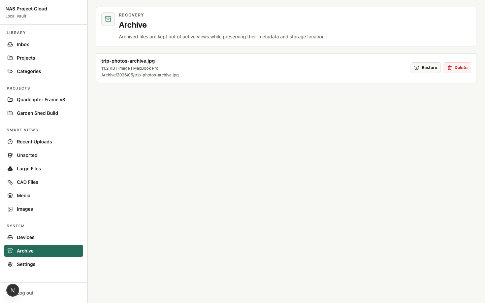
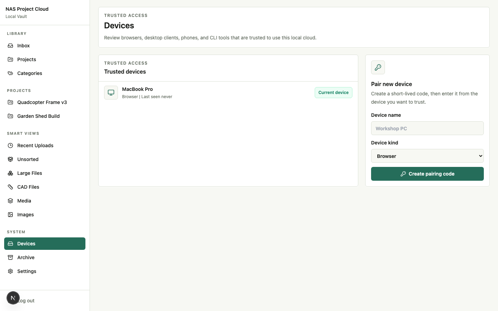

# NAS Project Cloud

A self-hosted, project-first file cloud for [TrueNAS SCALE](https://www.truenas.com/truenas-scale/). It feels like a private Google Drive built around real projects, but the bytes live on a ZFS dataset that you can still see from SMB, Finder, or Explorer when the app is offline.

> **Status:** pre-1.0 (`v0.1.x`). The MVP is shippable on a LAN, but the product is roughly half of where it's headed. See [Roadmap](#roadmap) for what's next and [Known limitations](#known-limitations) for what to expect today.

[](https://github.com/JonathanBeck1/nas-project-cloud/actions/workflows/ci.yml)
[](https://github.com/JonathanBeck1/nas-project-cloud/actions/workflows/docker-publish.yml)
[](./LICENSE)



## Why this exists

Tools like Nextcloud and OpenCloud are general-purpose. Tools like LocalSend are device-to-device. Neither is built around the workflow most makers actually run: a single NAS where every project lives in its own folder of CAD, prints, source files, exports, photos, and reference media. NAS Project Cloud keeps the NAS folder layout human-readable on disk while adding a workflow UI, metadata index, previews, large-file uploads, and trusted-device auth on top.

## Features

- **Project-first workspace** — Inbox, projects (with rename, status, delete), custom categories with color, taggable files, server-side search with composable filters, grid + list views, mobile sidebar drawer, dark mode, smart views, archive, and a 6-digit-code device pairing flow.
- **Direct filesystem storage** — files live as real files under `Inbox/`, `Projects/<slug>/Inbox/`, `Library/`, and `Archive/<year>/<month>/`. SMB and Finder still work.
- **SQLite metadata** — fast, single-file, journal-mode WAL. Indexed on project, category, family, and uploaded_at.
- **Resumable large uploads** — chunked sessions with 8 MiB chunks, offset checking, abort, and stale-session cleanup. Default upload cap 2 GiB.
- **Image previews** — automatic 384 px webp thumbnails generated by [`sharp`](https://sharp.pixelplumbing.com/), streamed from an authenticated route. Other preview families are queued and skipped for now.
- **Trusted-device auth** — owner bootstrap on first run, scrypt password hashing, HTTP-only session cookie, route guards on every API and page, and pairing-code device trust.
- **TrueNAS-ready** — Dockerfile, `docker-compose.truenas.yml`, deployment guide, and `/api/health` readiness check that exercises both the storage mount and the database.
- **CI/CD** — GitHub Actions builds and publishes `ghcr.io/jonathanbeck1/nas-project-cloud:latest` on every push to `main`, after running unit, type, lint, and build checks.

## Screenshots

| | |
| --- | --- |
|  |  |
| Projects index — count of files per workspace. | Project workspace — Garden Shed Build files, search, and stats. |
|  |  |
| Archive — soft-deleted files with restore + permanent delete. | Trusted devices — pair new devices with a 6-digit code. |

Captured with `npm run screenshots` (boots an isolated dev server, seeds sample data, drives Chromium via Playwright, and writes PNGs into `docs/screenshots/`).

## Tech stack

Next.js 15 App Router, React 19, TypeScript, Tailwind CSS, [Radix UI](https://www.radix-ui.com/) primitives, [`better-sqlite3`](https://github.com/WiseLibs/better-sqlite3), [`sharp`](https://sharp.pixelplumbing.com/), [`zod`](https://zod.dev/), [`nanoid`](https://github.com/ai/nanoid), Vitest + Testing Library, Playwright, and Docker on Node 22.

## Architecture

```text
                      ┌────────────────────────────────────────┐
                      │  Next.js App Router (server + client)  │
                      │  ┌──────────────┐  ┌────────────────┐  │
   browser / pairing  │  │ Page guards  │  │  API routes    │  │
   ─────────────────▶ │  │ requirePage  │  │  /api/files    │  │
                      │  │ Session()    │  │  /api/upload-  │  │
                      │  └──────┬───────┘  │  sessions/...  │  │
                      │         │          └───────┬────────┘  │
                      │         ▼                  ▼           │
                      │   src/lib/server: config · db · auth · │
                      │   metadata · storage · previews · ...  │
                      └────────┬───────────────────┬───────────┘
                               │                   │
                  ┌────────────▼─────┐   ┌─────────▼──────────┐
                  │ SQLite (WAL)     │   │ Filesystem storage │
                  │ /data/nas-cloud  │   │ /mnt/nas-cloud/    │
                  │ .sqlite          │   │   Inbox/           │
                  │                  │   │   Projects/<slug>/ │
                  │ users · sessions │   │   Library/         │
                  │ devices · files  │   │   Archive/YYYY/MM/ │
                  │ projects · tags  │   │   .uploads/*.part  │
                  │ upload_sessions  │   │   .previews/...    │
                  │ file_previews    │   │                    │
                  └──────────────────┘   └────────────────────┘
```

Files are the source of truth. SQLite is a metadata index that can be rebuilt from the storage tree with `npm run index:storage`.

## Quick start (development)

```bash
git clone https://github.com/JonathanBeck1/nas-project-cloud.git
cd nas-project-cloud
npm install
cp .env.example .env
npm run dev
```

Open <http://localhost:3000>. The first page redirects to `/setup` so you can create the owner account (12+ character password). After that, sign in at `/login` and you're in the workspace.

To wipe local state and start over:

```bash
rm -rf .data
```

## Quick start (TrueNAS SCALE)

The full guide lives at [`docs/deployment/truenas-scale.md`](./docs/deployment/truenas-scale.md). Short version:

1. Create two ZFS datasets:

   ```text
   /mnt/<pool>/nas-project-cloud/files
   /mnt/<pool>/nas-project-cloud/appdata
   ```

2. Make them writable by UID/GID `1001` (the container's `nextjs` user) or by an apps group it can join.

3. Paste [`docker/docker-compose.truenas.yml`](./docker/docker-compose.truenas.yml) into TrueNAS SCALE's custom-app YAML flow. Update the host volume paths to match your pool. The compose file pulls `ghcr.io/jonathanbeck1/nas-project-cloud:latest`.

4. Wait for `/api/health` to turn green. Browse to `http://<truenas>:3000`, finish owner setup, and you're done.

For a reverse-proxied deployment, raise the proxy's body-size limit to at least 2 GiB and disable buffering on the upload paths.

## Configuration

All runtime configuration is environment variables. Defaults are sane for local dev.

| Variable                       | Default                          | Description                                       |
| ------------------------------ | -------------------------------- | ------------------------------------------------- |
| `NAS_CLOUD_STORAGE_ROOT`       | `.data/storage`                  | Filesystem path that contains `Inbox/`, `Projects/`, `Library/`, `Archive/`, `.uploads/`, `.previews/`. |
| `NAS_CLOUD_DB_PATH`            | `.data/nas-cloud.sqlite`         | SQLite file. WAL companions are written next to it. |
| `NAS_CLOUD_PUBLIC_BASE_PATH`   | `/files`                         | Reserved for future public file-serving routes.   |
| `NAS_CLOUD_MAX_UPLOAD_BYTES`   | `2147483648` (2 GiB)             | Hard upload cap. Enforced at upload start, on every chunk, and on direct uploads. |

See [`.env.example`](./.env.example) and [`.env.truenas.example`](./.env.truenas.example).

## Development

```bash
npm run dev           # Next.js dev server on :3000
npm test              # Vitest unit + component tests
npm run typecheck     # tsc --noEmit
npm run lint          # eslint .
npm run build         # production build
npm run test:e2e      # Playwright (boots its own dev server on :3100)
npm run index:storage # rebuild the metadata index from disk
npm run previews:generate # process pending preview jobs
npm run screenshots   # regenerate docs/screenshots/*.png
```

The verification gate before any commit to `main` is:

```bash
npm test && npm run typecheck && npm run lint && npm run build && npm run test:e2e
```

The same gate runs on every pull request via [`.github/workflows/ci.yml`](./.github/workflows/ci.yml) and again in [`.github/workflows/docker-publish.yml`](./.github/workflows/docker-publish.yml) before the image is published.

## Project layout

```text
src/
  app/                      Next.js App Router (pages + API routes)
  components/
    auth/                   Owner auth and logout UI
    workspace/              AppShell, Sidebar, FileGrid, DropZone, etc.
  lib/
    client/                 fetch helpers (upload sessions, file actions)
    server/
      auth/                 password hashing, sessions, pairing, http guards
      previews/             enqueue + worker (sharp image thumbs)
      config.ts             env parsing
      db.ts                 schema + migrations + seeding
      metadata.ts           repository over SQLite
      storage.ts            sandboxed filesystem service
      indexer.ts            disk-to-DB walker
      smartViews.ts         server-side query builders
      health.ts             readiness probes
      pageSession.ts        page-level auth guard
      workspaceData.ts      compose data for the workspace shell
    shared/                 types, defaults, file-type classifier
docker/                     Dockerfile + TrueNAS compose example
docs/
  deployment/               TrueNAS SCALE deployment guide
  implementation/           per-phase build summaries
  research/                 storage-engine spike notes
  superpowers/              internal design specs and plans
scripts/                    index-storage, generate-previews, e2e prep, screenshot capture
tests/
  components/               Testing Library + Vitest component tests
  server/                   API + repository + storage + auth tests
  e2e/                      Playwright smoke tests
```

## Known limitations

NAS Project Cloud is intentionally LAN-first and pre-1.0. Things that are stubbed, partial, or deliberately deferred:

- **Search uses `LIKE`, not FTS.** Good for the typical NAS corpus; an SQLite FTS5 index lands once the test corpus exposes a hot path. Result lists are capped at 200 rows with a banner.
- **Previews: image and video today.** Video poster frames need `ffmpeg` (baked into the default Docker image). Document and CAD previews stay `skipped` until v0.3 PR 3 lands single-page PDF rendering. The Settings → Preview pipeline card shows live counts and an "ffmpeg ready / unavailable" badge.
- **Preview worker is opt-in.** Set `NAS_CLOUD_PREVIEW_SCHEDULER=on` to run the in-process scheduler, or hit `POST /api/maintenance/previews` from cron. Defaults to off so dev environments don't fight the test runner.
- **Upload Center shows open sessions only.** Failed and aborted sessions don't surface yet — coming in v0.3. Resume after a stale or failed session needs a desktop helper or explicit drag-back UX and is queued for v0.4.
- **Project delete leaves files on disk.** The metadata detaches them (project_id becomes null) but the bytes still live under `Projects/<slug>/Inbox/`. Move them via the bulk action bar in the inbox view if you want them out of that folder.
- **No share / temp-link surface.** Files are owner-only. Sharing requires the `nas_cloud_session` cookie or a paired device.

A more complete catalogue lives in [Roadmap](#roadmap) and in [`docs/superpowers/plans/2026-05-03-product-completion-sprint.md`](./docs/superpowers/plans/2026-05-03-product-completion-sprint.md).

## Roadmap

`v0.2.0` shipped the security hardening pass (CSRF double-submit cookies, rate-limited login/pairing, sliding sessions, token-protected maintenance endpoints, streaming direct uploads, defense-in-depth headers). Near-term, in priority order:

1. **`v0.3` preview pipeline.** In-process preview scheduler with a Settings status card *(in flight)*, video poster frames via `ffmpeg`, single-page PDF previews via `pdfjs-dist`, and Upload Center tabs that surface failed and aborted sessions. See [`docs/superpowers/plans/2026-05-20-v0.3-preview-pipeline-sprint.md`](./docs/superpowers/plans/2026-05-20-v0.3-preview-pipeline-sprint.md).
2. **Upload resume.** Either a desktop helper that retains the file handle or an explicit drag-back UX. Queued for `v0.4`.
3. **Move-files-back-on-project-delete** so the storage tree never has orphan project folders.
4. **CAD preview strategy decision** (STL/STEP) and a renderer-choice spike.
5. **Bulk download / zip stream**, **file rename in UI**, and **share / temp-link surface**.
6. **SQLite FTS5 migration** once the corpus exposes a hot path on the `LIKE`-backed search.
7. **Benchmark checklist** for 1 GiB and 5 GiB transfers over 2.5 Gb LAN, recorded in the deployment guide.
8. **Desktop helpers** (Tauri tray + clipboard sync + watch-folder ingest) once the web product is solid.

## Project history

This is a working project, not a polished release. The internal design specs and per-phase plans are kept in the repo so anyone reading the code can see why things are shaped the way they are:

- [`docs/superpowers/specs/2026-04-30-nas-project-cloud-design.md`](./docs/superpowers/specs/2026-04-30-nas-project-cloud-design.md) — the original design spec.
- [`docs/superpowers/plans/`](./docs/superpowers/plans/) — five plans, MVP through completion sprint.
- [`docs/implementation/`](./docs/implementation/) — what actually shipped in each phase.
- [`docs/research/storage-engine-spike.md`](./docs/research/storage-engine-spike.md) — why direct filesystem storage beat OpenCloud and Nextcloud as the V1 engine.

## Contributing

Issues and PRs are welcome. See [`CONTRIBUTING.md`](./CONTRIBUTING.md) for the verification gate, branch conventions, and schema-change rules. Bug and feature templates live under [`.github/ISSUE_TEMPLATE/`](./.github/ISSUE_TEMPLATE/). Security issues should be reported privately via [GitHub Security Advisories](https://github.com/JonathanBeck1/nas-project-cloud/security/advisories/new).

## License

[MIT](./LICENSE) © 2026 Jonathan Beck.
